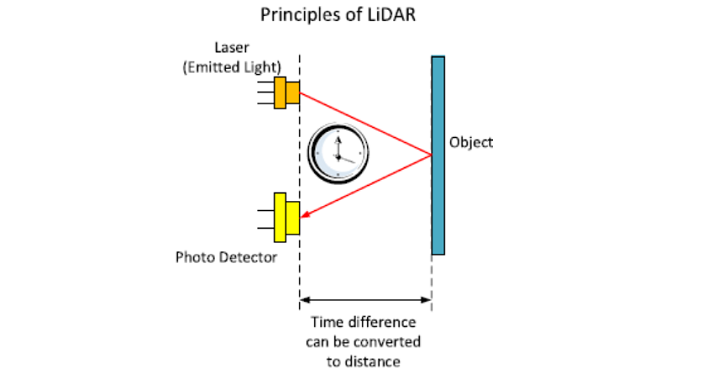

# Introduction to LiDAR

.pull-left[
- LiDAR (Light detection and ranging) is sometimes called “laser scanning” or “3D scanning”.

- LiDAR uses light in the form of a pulsed laser to measure range and distance.
  + Remote sensing method
  + Active sensor
  + Distance technology

- Consisting of a laser, a scanner, and a specialized GPS receiver.

- Airplanes and helicopters are the most commonly used platforms.

]

.pull-right[

A lidar map of Lynnhaven Inlet
Source: [NOAA](https://oceanservice.noaa.gov/facts/lidar.html)]

---

# How LiDAR works?
LiDAR is a sampling tool, which workflow can be summarized in the following five steps: 

.pull-left[1. LiDAR emits pulsed light waves into the environment.

2. Pulses bounce off and return to the LiDAR.

3. LiDAR uses time to calculate the distance.

4. Repeating this process millions of times

5. Creating a real-time 3D map of the environment.]

.pull-right[

Source: [Labroots](https://www.labroots.com/trending/technology/22851/lidar-archaeologists-forests-ancient-ruins)
]

---
# LiDAR Data

#### File Formats

- LiDAR data are available as discrete points.

- .las is the commonly used file format to store LIDAR data.

#### Data Attributes

- **x, y, z coordinates**: location information

- **Intensity**: return strength of the laser pulse

- **Point classification**: type of object (e.g ground/non-ground)

- **RGB**: RGB (red, green, and blue) bands

- **GPS time**: time stamp at which the laser point was emitted from aircraft

- **Other attributes**: Scan angle, Scan direction, Scan direction...

---
# The Application Of LiDAR

The high precision of LiDAR makes it widely used in industries and research: 

.pull-left[
- Autonomous Vehicles

- Aerial Inspection

- Precision Agriculture

- Forestry and Land management

- Survey and mapping

- Renewable Energy

- Forecast Disaster
  
- Robotics

- Atmospheric Studies

- Augmented reality]

.pull-right[

AR

Underwater Bathymetry

.footnote[Source:[GISGeography](https://gisgeography.com/lidar-uses-applications/#summary-lidar-uses-and-applications)]
]

---
# Paper 1: Application In Precision Agriculture
- 3D geodata play an increasingly important role in precision agriculture
- Modeling in-field variations of grain crop features such as height or biomass

---
# Paper 2: Application In Autonomous Robot
- Using LiDAR sensor to avoid obstacle
- Braitenberg vehicle strategy

---
# Paper 3: Application In River Bathymetries
- LiDARs could enable rapid surveys at sub-meter resolution over entire stream networks
- Using a green wavelength laser

---
class: inverse, center, middle
# Personal Reflection
### This week I have learned about the Xaringan and Quarto. These two useful tools help me better manage what I learned. Combing the R studio, github,Xaringan and Quarto, I achieve creating my personal pages, which is new for me and gives me a great sense of accomplishment. But at the same time, I realize that there is a lot to things about these two software, and I am directly exposed to the simplest part. So in th following time, I should focus on them more deeply.
---
# Reference:

[`Tonina, D., McKean, J.A., Benjankar, R.M., Wright, C.W., Goode, J.R., Chen, Q., Reeder, W.J., Carmichael, R.A., Edmondson, M.R., 2019. Mapping river bathymetries: Evaluating topobathymetric LiDAR survey. Earth Surface Processes and Landforms 44, 507–520. https://doi.org/10.1002/esp.4513`](https://onlinelibrary.wiley.com/doi/full/10.1002/esp.4513)

[`Hämmerle, M., Höfle, B., 2014. Effects of Reduced Terrestrial LiDAR Point Density on High-Resolution Grain Crop Surface Models in Precision Agriculture. Sensors 14, 24212–24230. https://doi.org/10.3390/s141224212`](https://www.mdpi.com/1424-8220/14/12/24212)

[`Hutabarat, D., Rivai, M., Purwanto, D., Hutomo, H., 2019. Lidar-based Obstacle Avoidance for the Autonomous Mobile Robot, in: 2019 12th International Conference on Information & Communication Technology and System (ICTS). Presented at the 2019 12th International Conference on Information & Communication Technology and System (ICTS), pp. 197–202. https://doi.org/10.1109/ICTS.2019.8850952`](https://ieeexplore.ieee.org/abstract/document/8850952)

